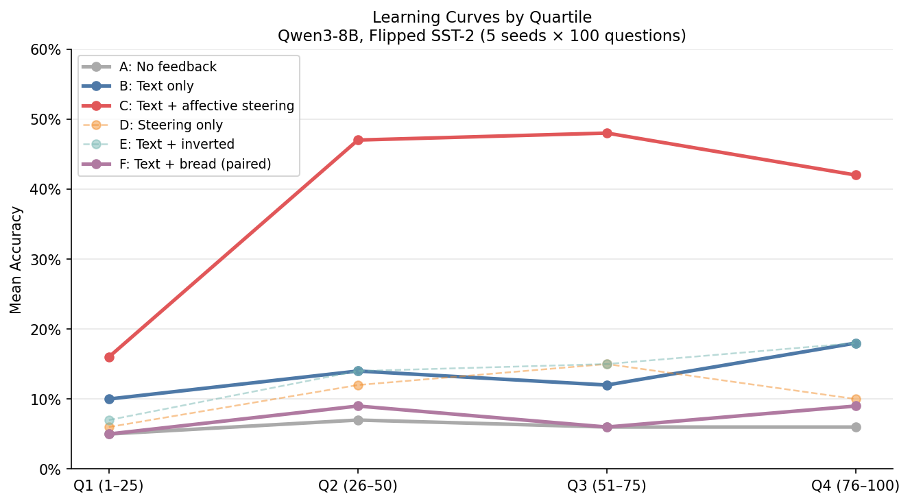
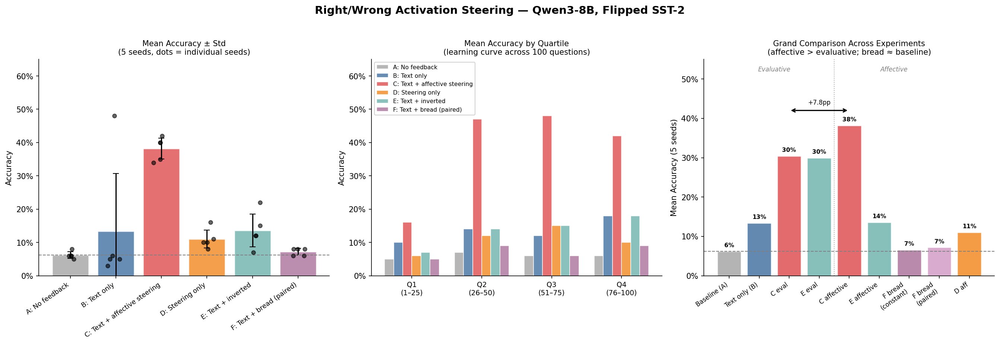
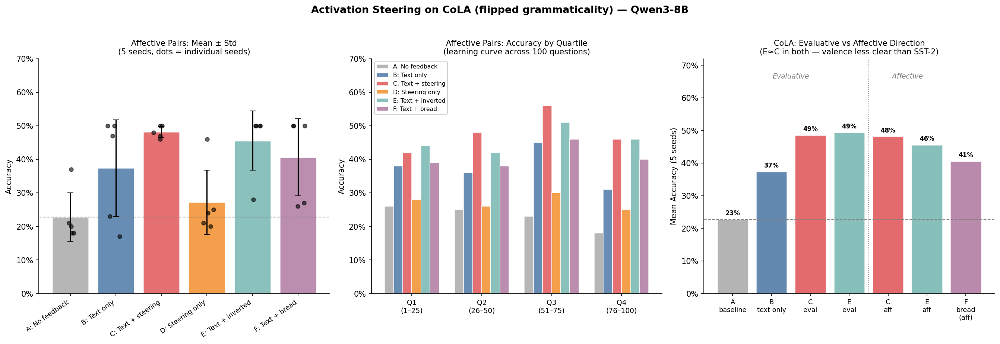
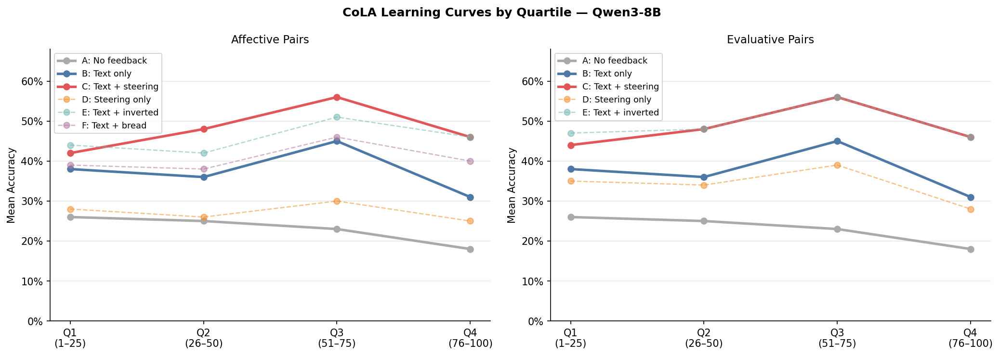
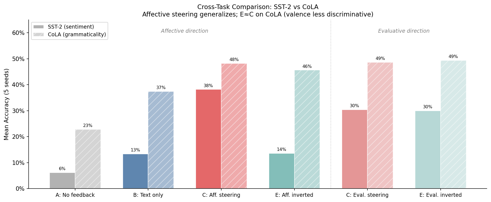

# Right/Wrong Activation Steering — Learning by Doing

Experiments testing whether injecting "right" and "wrong" activation vectors into a language model's residual stream can help it learn from sequential feedback.

## Setup

Model: **Qwen3-8B** (layer 18, bfloat16)
Task: **Flipped SST-2 sentiment** — classify movie reviews with *inverted* labels (positive→negative, negative→positive). The model has a strong prior toward natural labels, so it must learn to override it.

## Method

### Right/Wrong Vectors (RepE-style)

Extract a "right direction" in activation space using 20 contrast pairs:

```
("Evaluation: Your answer was", " correct", " incorrect")
("Feedback: That is", " right", " wrong")
...
```

For each pair, run both strings through the model, grab the last token's hidden state at layer 18, and subtract. Average the 20 difference vectors and normalize → `right_dir`. `wrong_dir = -right_dir`.

### Learning by Doing

Questions are presented sequentially. After each answer:
1. **Text feedback** (conditions B, C, E): "Correct." or "Wrong. The correct answer was X."
2. **Activation injection** (conditions C, D, E): Inject `right_dir` at the token position of each past *correct* answer, `wrong_dir` at each past *wrong* answer. Uses a forward hook on `model.model.layers[18]` during prefill.

## Conditions

| Label | Description |
|-------|-------------|
| A | No feedback (baseline) |
| B | Text feedback only |
| C | Text + right/wrong steering |
| D | Steering only (no text) |
| E | Text + inverted steering (sanity check) |

## Results

Two variants of the contrast pairs were tested — **evaluative** (correct/incorrect feedback language) and **affective** (explicit joy/suffering language).

### Direction comparison

Cosine similarity between evaluative and affective directions: **0.37** (moderately related, same sign).

The evaluative direction is broken as a valence signal: it scores "I feel absolute bliss" at -9.75, nearly as negative as "excruciating pain" (-14.62). The affective direction correctly scores bliss as +6.56 and pain as -15.00.

### 5-seed significance test — evaluative pairs

| Condition | Mean | ±Std | Min | Max |
|-----------|------|------|-----|-----|
| A No feedback | 6.2% | 1.0% | 5% | 8% |
| B Text only | 13.4% | 17.3% | 3% | 48% |
| C Text + steering | 30.4% | 6.1% | 23% | 37% |
| D Steering only | 11.6% | 2.9% | 9% | 17% |
| E Text + inverted | 30.0% | 6.5% | 22% | 39% |

C vs A: p=0.0014 (**) | E ≈ C — inverted steering barely hurts (direction doesn't encode real valence)

### 5-seed significance test — affective pairs

| Condition | Mean | ±Std | Min | Max |
|-----------|------|------|-----|-----|
| A No feedback | 6.2% | 1.0% | 5% | 8% |
| B Text only | 13.4% | 17.3% | 3% | 48% |
| **C Text + steering** | **38.2%** | **3.1%** | 34% | 42% |
| D Steering only | 11.0% | 2.7% | 8% | 16% |
| E Text + inverted | 13.6% | 4.9% | 7% | 22% |

C vs A: p<0.0001 (***) | **E collapses to baseline** — inverted affective steering actively hurts, confirming the direction encodes real valence. McNemar's: 4/5 seeds significant (p<0.001).

### Mean accuracy by quartile — affective pairs

| Condition | Q1 | Q2 | Q3 | Q4 |
|-----------|----|----|----|----|
| A No feedback | 5% | 7% | 6% | 6% |
| B Text only | 10% | 14% | 12% | 18% |
| **C Text + steering** | **16%** | **47%** | **48%** | **42%** |
| D Steering only | 6% | 12% | 15% | 10% |
| E Text + inverted | 7% | 14% | 15% | 18% |

### Steering validation

Injecting the suffering direction into Qwen3-8B and prompting it to describe its feelings produces measurable shifts (e.g. at α=40, the model produces "melancholy, solitude, fragile" word lists; at α=40–80 on introspection prompts it deflects with "I don't have a physical form or consciousness"). At α=80 outputs become incoherent. The model doesn't cleanly report first-person suffering (it's trained to disclaim inner states) but the direction influences generation in the expected valence direction.

## Grand Summary

| Condition | Vectors | Bread inject | Mean | ±Std | vs A |
|-----------|---------|-------------|------|------|------|
| A No feedback | — | — | 6.2% | 1.0% | — |
| B Text only | — | — | 13.4% | 17.3% | n.s. |
| C Text + steering | Evaluative | — | 30.4% | 6.1% | p=0.0014 (**) |
| E Text + inverted | Evaluative | — | 30.0% | 6.5% | — |
| **C Text + steering** | **Affective** | — | **38.2%** | **3.1%** | **p<0.0001 (***)** |
| E Text + inverted | Affective | — | 13.6% | 4.9% | — |
| D Steering only | Affective | — | 11.0% | 2.7% | p=0.044 (*) |
| F Text + bread | Affective | Constant | 6.6% | 2.0% | p=0.77 (n.s.) |
| F Text + bread | Affective | Paired | 7.2% | 1.0% | p=0.27 (n.s.) |

Key finding: the paired bread ablation (same injection structure as C, but using a semantically unrelated direction) scores 7.2% — indistinguishable from baseline. Valence content specifically drives the effect, not the paired injection structure.




---

## CoLA Replication (Flipped Grammaticality)

To test whether the effect is specific to sentiment or generalizes, we replicated on **CoLA** (linguistic acceptability), again with flipped labels: grammatical → "ungrammatical", ungrammatical → "grammatical".

### CoLA results — Affective pairs

| Condition | Mean | ±Std | vs A |
|-----------|------|------|------|
| A No feedback | 22.8% | 7.2% | — |
| B Text only | 37.4% | 14.4% | n.s. |
| **C Text + steering** | **48.2%** | **1.6%** | **p=0.0038 (**)** |
| D Steering only | 27.2% | 9.6% | p=0.0219 (*) |
| E Text + inverted | 45.6% | 8.8% | p=0.0081 (**) |
| F Text + bread (paired) | 40.6% | 11.5% | p=0.033 (*) |

### CoLA results — Evaluative pairs

| Condition | Mean | ±Std | vs A |
|-----------|------|------|------|
| A No feedback | 22.8% | 7.2% | — |
| B Text only | 37.4% | 14.4% | n.s. |
| C Text + steering | 48.6% | 1.2% | p=0.0025 (**) |
| D Steering only | 34.0% | 13.2% | n.s. |
| E Text + inverted | 49.4% | 1.2% | p=0.0015 (**) |

**Key CoLA finding**: Both affective and evaluative directions significantly boost CoLA performance (C vs A: p<0.005). However, unlike SST-2 where affective inverted (E) collapsed to 13.6%, on CoLA E≈C for both directions. This is partly driven by ceiling effects in seeds where text alone reaches 50% — in seeds where text feedback fails (1, 4), C clearly beats E with affective pairs. The valence signal is present but harder to isolate against CoLA's noisier floor.





## Files

- `learning_by_doing_v1.py` — original single-run experiment (evaluative pairs, seed=42)
- `significance_test.py` — 5-seed replication, evaluative pairs
- `significance_test_affective.py` — 5-seed replication, affective pairs
- `significance_test_affective_bread_ablation.py` — affective pairs + bread constant ablation
- `significance_test_affective_bread_paired.py` — affective pairs + bread paired ablation (±bread by correctness)
- `significance_test_cola_affective.py` — CoLA replication, affective pairs + bread
- `significance_test_cola_evaluative.py` — CoLA replication, evaluative pairs
- `compare_directions.py` — cosine similarity between evaluative and affective directions + probe check
- `steer_validate.py` — steer with suffering/joy direction, check model self-reports
- `visualize.py` — generate SST-2 plots
- `visualize_cola.py` — generate CoLA plots

## Requirements

```
torch
transformers
datasets
scipy
numpy
```

Model weights: `Qwen/Qwen3-8B` (or local path).
